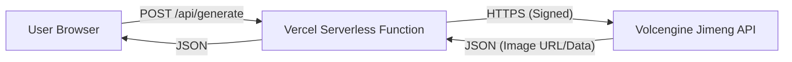

# Technical Architecture Document - Jimeng API Integration

## 1. System Overview
The system consists of a frontend React application and a backend serverless function hosted on Vercel. The backend acts as a proxy to the Volcengine API to secure the credentials.

## 2. Architecture Diagram


## 3. Tech Stack
- **Frontend**: React, TypeScript, Vite, Tailwind CSS
- **Backend**: Node.js (Vercel Serverless Functions)
- **API Client**: `@volcengine/openapi`
- **Deployment**: Vercel

## 4. Directory Structure
```
/
├── api/
│   └── generate.ts       # Serverless function for image generation
├── src/
│   ├── components/       # UI Components
│   ├── App.tsx           # Main application logic
│   └── main.tsx          # Entry point
├── .env                  # Environment variables (local)
├── package.json
└── tsconfig.json
```

## 5. API Design
### 5.1 Internal API
- **Endpoint**: `/api/generate`
- **Method**: `POST`
- **Request Body**:
  ```json
  {
    "prompt": "A futuristic city with flying cars"
  }
  ```
- **Response**:
  ```json
  {
    "success": true,
    "data": {
      "image_url": "https://..."
    }
  }
  ```

### 5.2 External API (Volcengine)
- **Service**: `visual`
- **Action**: `HighAesSmartDrawing` (or `CVProcess` depending on latest docs)
- **Version**: `2022-08-31`
- **Authentication**: HMAC-SHA256 Signature (handled by SDK)

## 6. Security
- `VOLC_ACCESS_KEY` and `VOLC_SECRET_KEY` are stored in Vercel Environment Variables.
- No sensitive keys are exposed to the client.

## 7. Deployment
- The project is configured as a Vite app.
- Vercel automatically detects the `api` directory as serverless functions.
